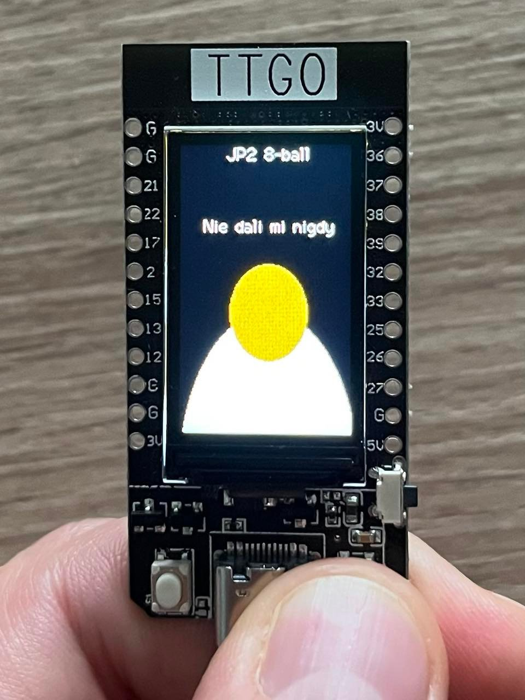

# John ESPaul32 (TTGO T-display)

Consider it a overcomplicated 8-ball.

* Shows minimalistic picture of John Paul II.
* Upon pressing left button it draws eyes of his holiness.
* Upon pressing right button it writes one of his many responses to children.

## Technicalities

This demo utilizes following TTGO capabilities:

* TTGO Screen (via TFT_eSPI lib)
* Buttons (via Button2 lib)
* Hardware Espressif timers

It is best opened in vscode with platformio extension.

## But how does it look like?

Simply. Spectacular.

## Documentation

* https://docs.espressif.com/projects/esp-idf/en/latest/esp32/api-reference/index.html